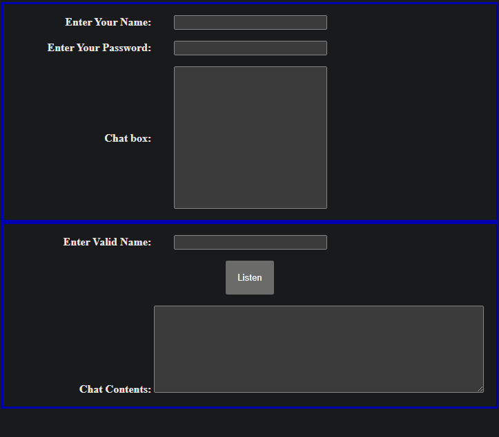

# Simple-Chat-Application
A simple chat application that uses AJAX, PHP, MySQL and SQL. Validates username and password before allowing messages to be sent. Other users can click on the listen button to retrieve messages from the name of a valid user that is in the database. Username and password login information is included in the ``chattable.csv`` file. 

